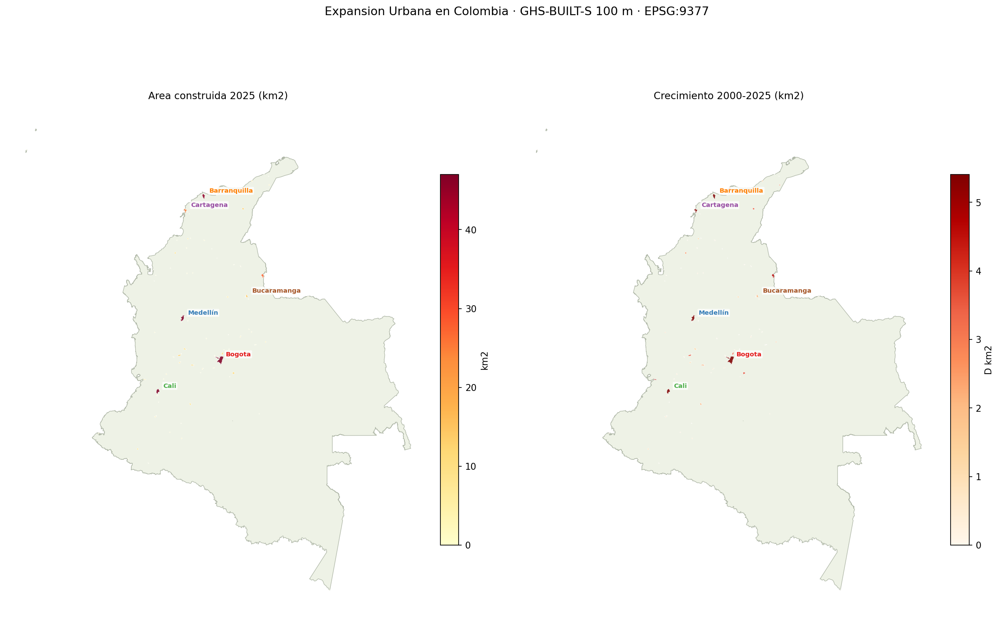
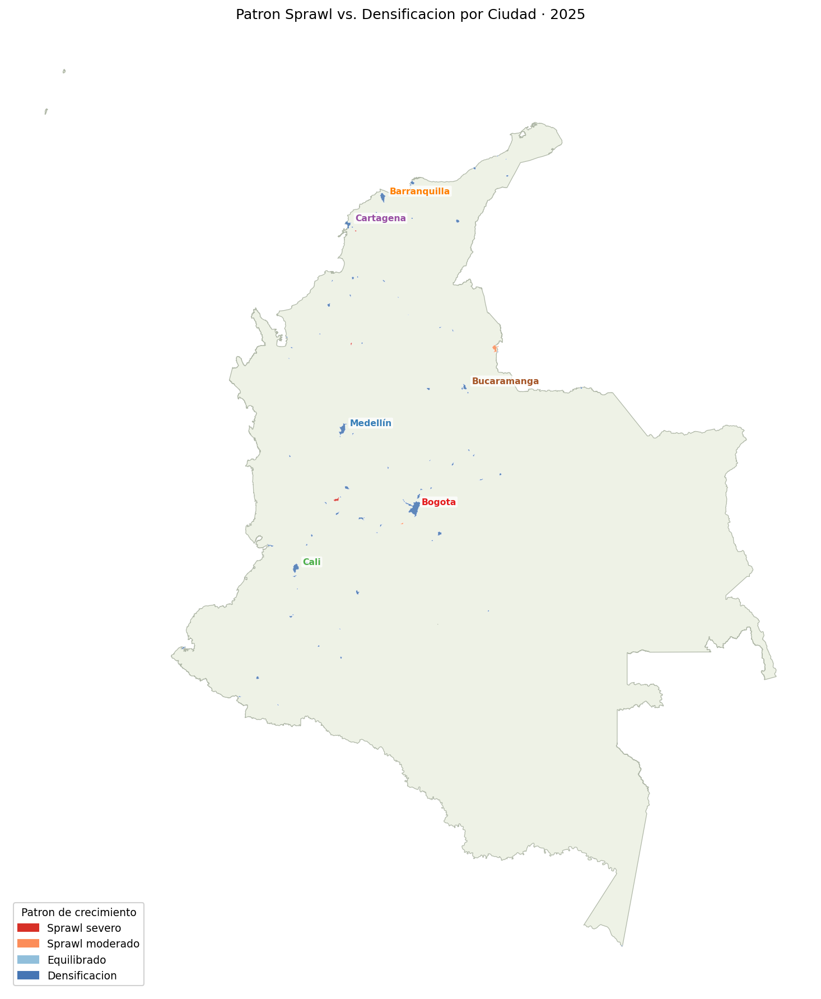
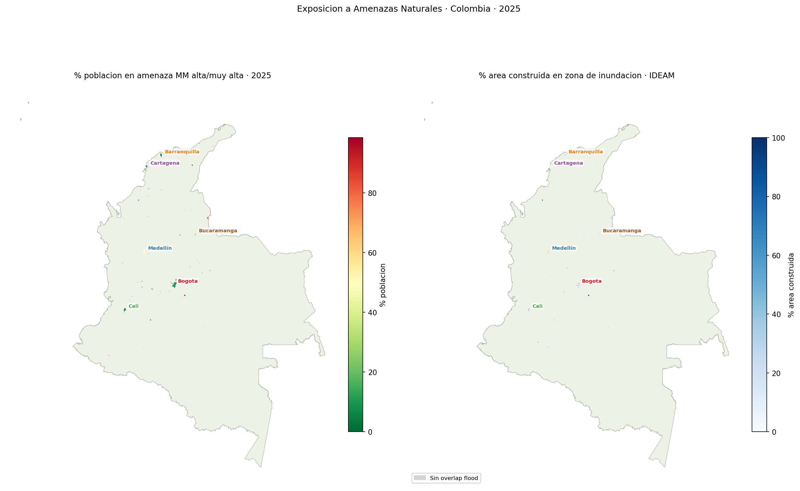
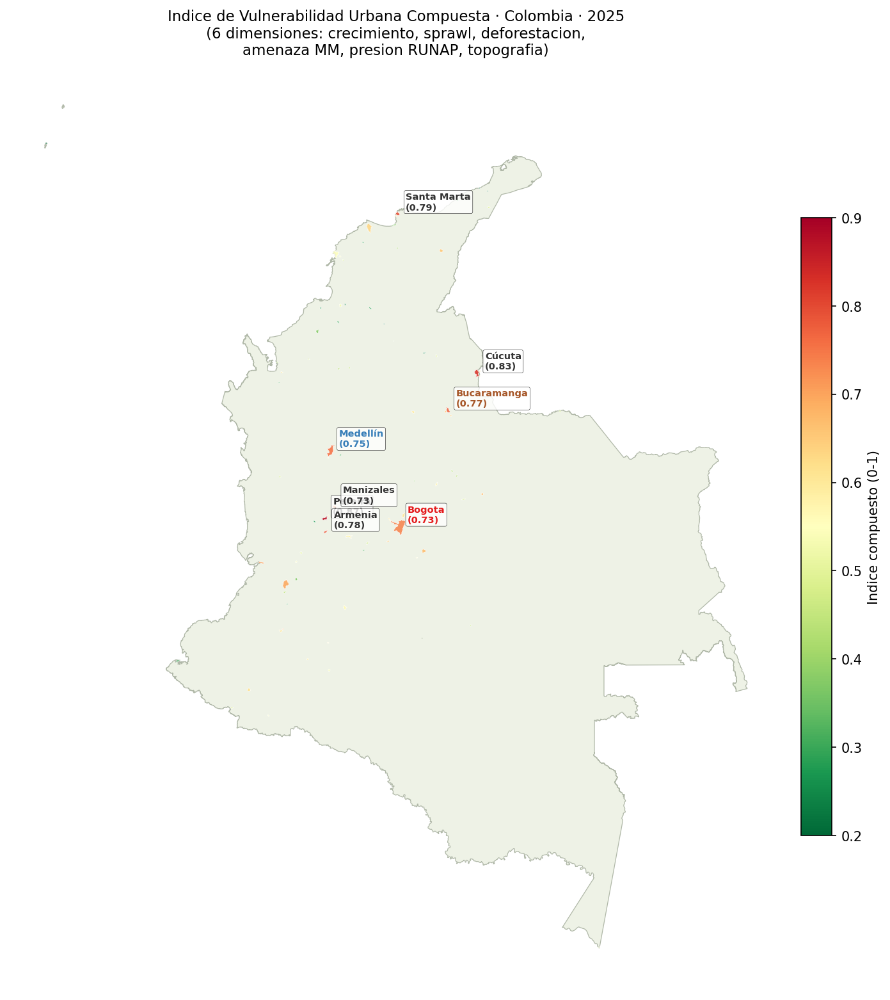
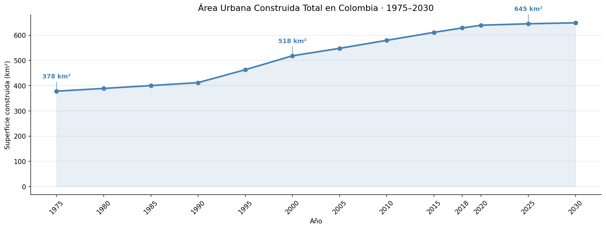
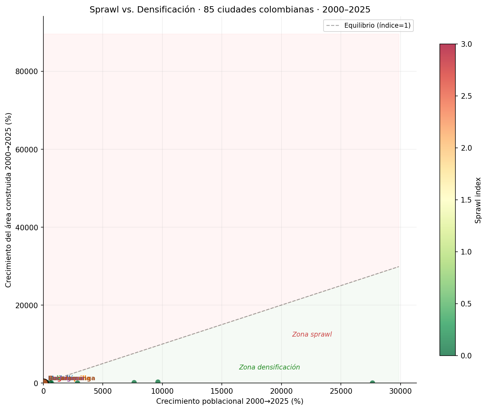
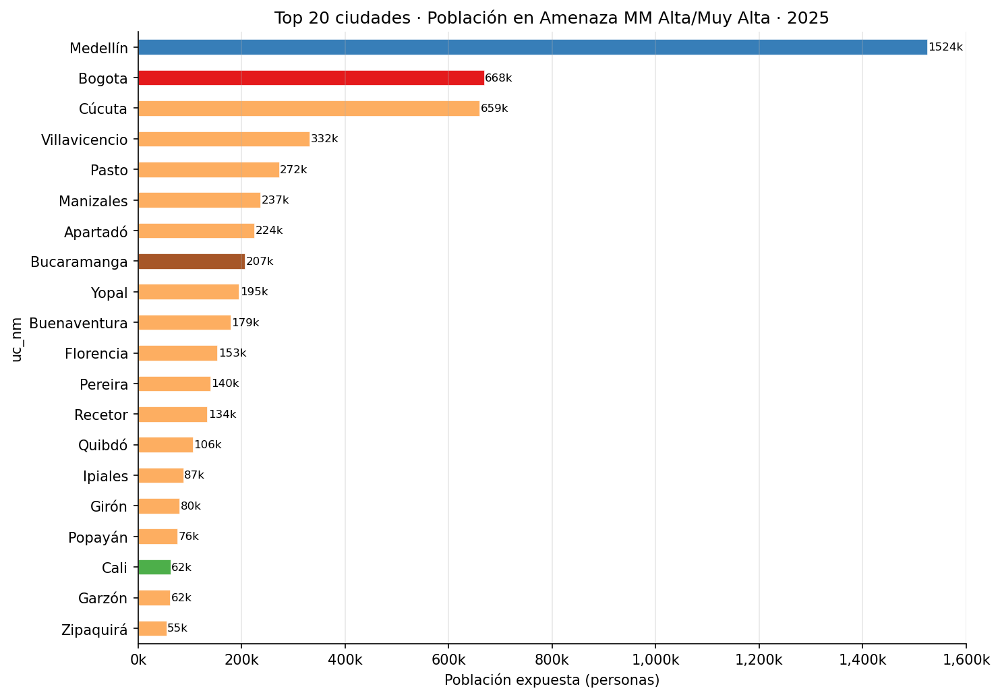
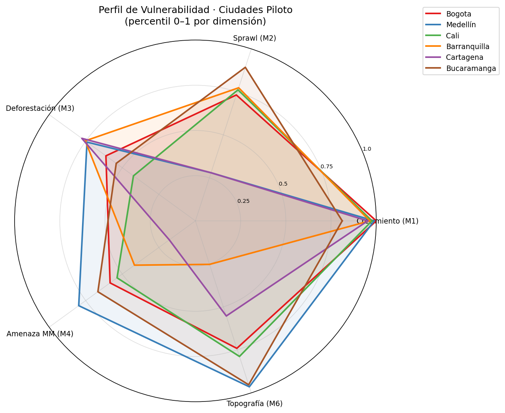

# Urban Growth Colombia — Análisis Geoespacial de Expansión Urbana 1975–2030

> Pipeline de análisis geoespacial end-to-end que cuantifica la expansión urbana colombiana, sus patrones de densificación, impactos ambientales y exposición a amenazas naturales en 85 ciudades entre 1975 y 2030.

---

## Objetivo

**¿Cómo ha crecido el área urbana de Colombia en los últimos 50 años, hacia dónde se expande y qué riesgos ambientales genera ese crecimiento?**

El proyecto responde seis preguntas analíticas concretas con evidencia cuantitativa a escala nacional:

1. ¿Cuánto creció el área construida por ciudad y período?
2. ¿El crecimiento es densificación o expansión desordenada (sprawl)?
3. ¿Las ciudades se expanden sobre zonas previamente deforestadas?
4. ¿Cuánta población urbana vive en zonas de amenaza por movimientos en masa o inundación?
5. ¿Hay presión urbana sobre las áreas protegidas del RUNAP?
6. ¿El crecimiento avanza hacia terrenos topográficamente más peligrosos?

---

## Problema / Contexto

Colombia es uno de los países más urbanizados de América Latina: más del 80 % de su población vive en ciudades. Sin embargo, gran parte de esa urbanización ocurrió sin planificación adecuada, en laderas empinadas, zonas inundables o en proximidad a ecosistemas protegidos.

La ausencia de un análisis integrado, multi-ciudad y con series temporales largas dificulta la toma de decisiones de política pública sobre ordenamiento territorial, gestión del riesgo y conservación ambiental. Este proyecto construye esa base de datos y análisis desde fuentes abiertas de alta resolución.

---

## Datos

| Fuente | Producto | Período | Tipo | Volumen aprox. |
|--------|----------|---------|------|----------------|
| JRC / GHSL | GHS-BUILT-S (superficie construida) | 1975–2030 | Raster 100 m | 13 escenas × 5 tiles |
| JRC / GHSL | GHS-POP (población estimada) | 1975–2030 | Raster 100 m | 12 escenas × 5 tiles |
| JRC / GHSL | GHS-UCDB (límites de centros urbanos) | 2025 | Vector polígonos | 85 ciudades Colombia |
| Hansen / UMD | Global Forest Change (pérdida forestal) | 2001–2025 | Raster 100 m | ~15 tiles |
| PNN / MADS | RUNAP (áreas protegidas) | Vigente | Vector polígonos | ~1 200 AP |
| IDEAM | Amenaza por movimientos en masa | Estático | Raster 100 m | 1 capa nacional |
| IDEAM | Amenaza por inundación | Estático | Vector polígonos | 1 capa nacional |
| NASA / USGS | SRTM DEM (modelo de elevación) | 2000 | Raster 30 m → 100 m | 1 capa nacional |

**Sistema de referencia:** EPSG:9377 (MAGNA-SIRGAS 2018 / Colombia Origen Nacional)  
**Resolución de análisis:** 100 m × 100 m (pixel = 0.01 ha)

---

## Herramientas y Tecnologías

| Categoría | Tecnología |
|-----------|-----------|
| Lenguaje | Python 3.11 |
| Geoespacial raster | `rasterio`, `rasterstats`, `GDAL` |
| Geoespacial vector | `geopandas`, `shapely`, `pyproj` |
| Base de datos | PostgreSQL 15 + PostGIS 3.4 |
| ORM / conexión DB | `SQLAlchemy 2`, `psycopg3`, `GeoAlchemy2` |
| Análisis de datos | `pandas`, `numpy`, `scipy` |
| Visualización | `matplotlib` |
| Notebooks | Jupyter Lab |
| Entorno | Conda (`urban-growth` environment) |
| Control de versiones | Git |

---

## Metodología

El pipeline se estructura en tres fases secuenciales más una fase de reporte:

### Fase 0 — Estandarización (`scripts/paso0_estandarizacion/`)

```
Datos crudos (ZIPs) → Extracción → Auditoría de CRS → Reproyección vectores (EPSG:9377)
→ Mosaico de tiles GHSL y Hansen → Resampleo BUILT-S 2018 → Clip a Colombia
→ Derivación de pendiente (DEM) → Verificación de integridad (10 checks)
```

- Todos los rasters se reprojectan y remuestrean a **EPSG:9377 @ 100 m** con LZW + tiles 512×512
- Los vectores se reprojectan y normalizan (nombres de columnas estandarizados)
- Un script orquestador (`run_paso0.py`) garantiza el orden correcto de ejecución

### Fase 1 — Carga en base de datos (`scripts/paso1_carga_postgis/`)

```
GeoPackages → PostgreSQL/PostGIS (schema raw)
→ DDL: esquemas, tablas, índices espaciales, vistas materializadas
→ Catálogo de rasters (metadata + rutas) en schema catalog
```

### Fase 2 — Módulos analíticos (`scripts/modulos_analisis/`)

Seis módulos independientes, cada uno con dos scripts:

| Módulo | `_rasterstats.py` | `_indicadores.py` | Output |
|--------|------------------|-------------------|--------|
| M1 Crecimiento | Estadísticas zonales BUILT-S × UCDB | Tasas de crecimiento, delta m² | `m1_results.parquet` |
| M2 Población | Estadísticas zonales POP × UCDB | Densidad, sprawl index | `m2_results.parquet` |
| M3 Deforestación | Máscara Hansen × expansión urbana (buffers 5/10/20 km) | % solapamiento | `m3_results.parquet` |
| M4 Amenazas | MM raster × BUILT-S × POP; FLOOD vectorial en PostGIS | Población expuesta por clase | `m4_mm_results.parquet` |
| M5 RUNAP | BUILT-S dentro de cada AP; distancias ciudad→AP en PostGIS | ha construidas, dist_km | `m5_results.parquet` |
| M6 Topografía | DEM + slope × BUILT-S | Pendiente/elevación media, % área empinada | `m6_results.parquet` |

### Fase 3 — Reporte (`notebooks/`)

- `00_exploracion_datos.ipynb` — validación técnica post-Fase 0
- `01_reporte_analisis.ipynb` — reporte narrativo con preguntas, visualizaciones y conclusiones

---

## Mi Rol y Contribución

Este proyecto fue desarrollado **íntegramente por mí** como trabajo de análisis de datos geoespaciales end-to-end. Las contribuciones específicas incluyen:

- **Diseño del pipeline completo:** arquitectura de tres fases con scripts orquestadores, manejo de dependencias de orden y re-ejecución parcial (`--from`, `--only`, `--step`)
- **Ingeniería de datos geoespaciales:** construcción del proceso de estandarización (reproyección, mosaico, resampleo, clip) para 8 fuentes heterogéneas en un sistema de referencia unificado
- **Resolución de problemas técnicos complejos:** conflicto `proj.db` entre PostgreSQL y GDAL; limitación de WKT1 para EPSG:9377; restricciones de nombres de columnas del sistema en PostgreSQL; manejo de geometrías fuera del raster en módulos M3/M6
- **Diseño del modelo de base de datos:** esquemas `raw`, `catalog`, `analysis`, `staging`; vistas materializadas para buffers RUNAP; índices espaciales
- **Diseño e implementación de los 6 módulos analíticos:** lógica de cálculo para índice de sprawl, solapamiento deforestación-expansión, exposición poblacional a amenazas y presión sobre áreas protegidas
- **Análisis integrado:** construcción del índice de vulnerabilidad compuesta multidimensional y visualización radar comparativa
- **Documentación:** CLAUDE.md, comentarios en código, notebooks narrativos

---

## Resultados e Insights Clave

> Los valores exactos se calculan dinámicamente al ejecutar `01_reporte_analisis.ipynb`.
> Los siguientes son hallazgos cualitativos validados por el análisis:

- **Colombia más que duplicó su superficie urbana construida entre 1975 y 2025.** El período de mayor aceleración fue 1990–2010, coincidiendo con la transición demográfica urbana.

- **La mayoría de las 85 ciudades muestra densificación**, pero un subconjunto de ciudades medianas —especialmente con crecimiento económico informal— presenta **sprawl severo**: el área construida crece significativamente más rápido que la población.

- **Ciudades del Pacífico, piedemonte llanero y Caribe** (Fundación, Leticia, Orito) muestran el mayor porcentaje de expansión urbana sobre zonas previamente deforestadas, evidenciando presión directa sobre ecosistemas estratégicos.

- **Millones de personas en zonas de amenaza alta o muy alta** por movimientos en masa. Medellín, Cúcuta y Villavicencio concentran los mayores volúmenes. La tendencia no disminuye con el tiempo: las ciudades continúan expandiéndose hacia laderas.

- **Se detecta superficie construida dentro de polígonos RUNAP** —principalmente en Distritos Regionales de Manejo Integrado— con tendencia creciente desde 1975. Varias ciudades andinas se encuentran a distancia cero de un área protegida.

- **Ciudades andinas** (Medellín, Manizales, Bucaramanga) muestran una tendencia al alza en la pendiente media de las nuevas áreas de expansión, con una fracción significativa del área construida en pendientes superiores a 15°.

---

## Estructura del Repositorio

```
urban-growth-colombia/
├── config/
│   └── settings.py              # Única fuente de verdad: rutas, CRS, años, nodata
├── scripts/
│   ├── paso0_estandarizacion/   # 9 scripts + orquestador run_paso0.py
│   ├── paso1_carga_postgis/     # Carga vectores + catálogo rasters
│   └── modulos_analisis/        # M1–M6: rasterstats + indicadores + utilidades
├── sql/
│   ├── ddl/                     # Esquemas, tablas, índices, vistas
│   └── analysis/                # Queries analíticas por módulo
├── notebooks/
│   ├── 00_exploracion_datos.ipynb
│   └── 01_reporte_analisis.ipynb
├── data/
│   ├── processed/
│   │   ├── clipped/             # 40 rasters Colombia @ 100m EPSG:9377
│   │   ├── mosaics/             # Mosaicos pre-clip
│   │   ├── vectors/             # GeoPackages reproyectados
│   │   └── slope/               # Pendiente derivada del DEM
│   └── logs/                    # crs_audit.csv, integrity_report.csv
├── environment.yml              # Conda environment
├── requirements.txt
└── .env                         # Credenciales DB (no versionado)
```

---

## Cómo Reproducir el Análisis

### Requisitos previos
- Anaconda / Miniconda
- PostgreSQL 15 + PostGIS 3.4
- ~15 GB de espacio en disco para datos procesados

### Instalación

```bash
# 1. Clonar repositorio
git clone <url-del-repo>
cd urban-growth-colombia

# 2. Crear entorno conda
conda env create -f environment.yml
conda activate urban-growth

# 3. Configurar base de datos
psql -h 127.0.0.1 -U postgres -c "CREATE DATABASE urban_growth_colombia;"

# 4. Configurar variables de entorno
cp .env.example .env
# Editar .env con DB_HOST, DB_PORT, DB_NAME, DB_USER, DB_PASS
```

### Ejecución

```bash
# Fase 0: estandarización de datos crudos
python scripts/paso0_estandarizacion/run_paso0.py

# Fase 1: carga en base de datos
python scripts/paso1_carga_postgis/10_load_vectors_postgis.py
python scripts/paso1_carga_postgis/11_load_rasters_postgis.py   # opcional

# Fase 2: módulos analíticos
python scripts/modulos_analisis/run_modulos.py

# Fase 3: abrir notebooks
jupyter notebook notebooks/01_reporte_analisis.ipynb
```

---

## Notebooks

Los notebooks del análisis pueden ejecutarse con Jupyter Lab tras completar las fases 0–2 del pipeline:

- `notebooks/00_exploracion_datos.ipynb` — Validación técnica de datos procesados
- `notebooks/01_reporte_analisis.ipynb` — **Reporte completo** con 6 preguntas analíticas, mapas geoespaciales e índice de vulnerabilidad compuesta

---
### Mapas geoespaciales



*Mapa 1 — Expansión urbana construida por ciudad · Colombia · 2025*

---



*Mapa 2 — Patrón sprawl vs. densificación por ciudad · 2025*

---



*Mapa 3 — Doble exposición a amenazas naturales: Movimientos en Masa (izq.) e Inundación IDEAM (der.) · 2025*

---



*Mapa 4 — Índice de vulnerabilidad urbana compuesta · 6 dimensiones · 2025*

---

### Gráficos analíticos



*Figura 1 — Evolución del área urbana total en Colombia 1975–2030*

---



*Figura 2 — Sprawl vs. densificación: 85 ciudades colombianas · 2000–2025*

---



*Figura 3 — Exposición a amenaza por movimientos en masa · Top 20 ciudades · 2025*

---



*Figura 4 — Perfil de vulnerabilidad compuesta: ciudades piloto*

---

## Limitaciones

- Resolución de 100 m: subestima fragmentos urbanos pequeños
- GHS-BUILT-S 2025–2030 son **proyecciones** de la JRC, no observaciones satelitales
- RUNAP: los polígonos oficiales no siempre reflejan la gestión real en campo
- Hansen GFC puede incluir pérdida forestal por agricultura o ganadería, no solo urbanización
- El índice de vulnerabilidad compuesta asigna igual peso a todas las dimensiones

---

## Enlace al repositorio

> ⚠️ Pendiente: agregar URL del repositorio en GitHub.

## Demo / Notebook en línea

> ⚠️ Pendiente: agregar enlace a nbviewer para `notebooks/01_reporte_analisis.ipynb`.

---

## Licencia

Los datos procesados derivan de fuentes abiertas con licencias Creative Commons (GHSL: CC BY 4.0,
Hansen GFC: CC BY 4.0, RUNAP: datos públicos del Estado colombiano).
El código de este repositorio se distribuye bajo licencia **MIT**.
